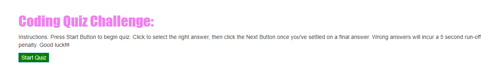
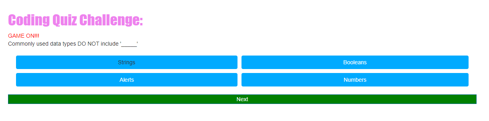
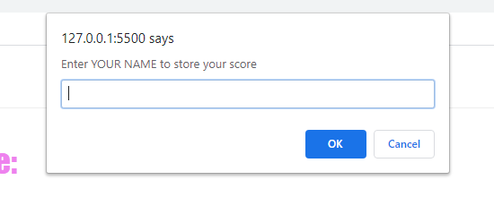

Decription: 
*Coding Quiz - (I have created a coding quiz unsing a combination of HTML, CSS/Bootstrap and dynamic JS.  The quiz includes multiple choice questions, a timer and is built to reward correct answers with score points and punish incorrect answers with a time run-off).
*Submission date of 12/3/2020

Screenshots:

Links: 
*GitHub Repository: https://github.com/awoolley1/WebAPIsQuizBuild
*Live URL: https://awoolley1.github.io/WebAPIsQuizBuild/

Author: 
*Alex Woolley; https://github.com/awoolley1; alexander.s.woolley@gmail.com